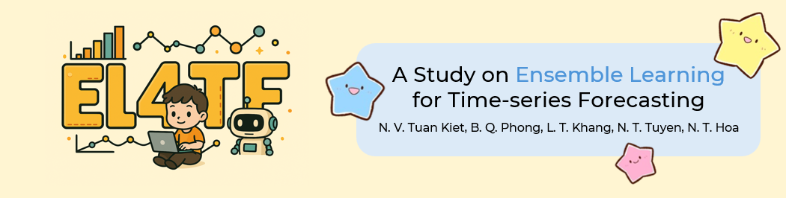

# 🌟 EL4TF: A Study on Ensemble Learning in Time-Series Forecasting 📊

## 🚀 News

- **03/2025:** Project initiated.

## 📖 Table of Contents

1. [📌 Introduction](#introduction)
2. [📊 Data](#data)
   - [🗂 Dataset](#dataset)
3. [🛠 Methodology](#methodology)
4. [📈 Results](#results)

---

## 📌 Introduction

⏳ Time series forecasting is a crucial task in various fields such as stock market prediction, weather forecasting, and sales forecasting. Traditional forecasting methods often rely on a single model to predict future values, which may not capture the complexity of the underlying data.

🔍 In this study, we explore the effectiveness of **ensemble learning** in time series forecasting, leveraging different publicly available datasets.

---

## 📊 Data

### 🗂 Dataset

📁 **All datasets used in this study are publicly available on Kaggle and stored in the `data/` folder.**

| 📌 **Name**               | 📆 **Period** | ⏳ **Frequency** | 🔗 **Source**                                                                                     | 📂 **Folder**              | 🎯 **Task**    |
| ------------------------- | ------------- | ---------------- | ------------------------------------------------------------------------------------------------- | -------------------------- | -------------- |
| 📈 **3 Stocks & Bitcoin** | 2013 - 2019   | Daily            | [Kaggle](https://www.kaggle.com/datasets/hershyandrew/amzn-dpz-btc-ntfx-adjusted-may-2013may2019) | [`data/stock`](data/stock) | Regression     |
| 🚗 **Tesla Stock Price**  | 2017 - 2017   | Daily            | [Kaggle](https://www.kaggle.com/datasets/rpaguirre/tesla-stock-price)                             | [`data/tesla`](data/tesla) | Regression     |
| 🌡 **Daily Delhi Climate** | 2013 - 2017   | Daily            | [Kaggle](https://www.kaggle.com/datasets/sumanthvrao/daily-climate-time-series-data)              | [`data/delhi`](data/delhi) | Regression     |
| 🏬 **Superstore Sales**   | 2015 - 2018   | Daily            | [Kaggle](https://www.kaggle.com/datasets/rohitsahoo/sales-forecasting)                            | [`data/sales`](data/sales) | Regression     |
| 🦠 **Covid-19 Cases**     | 2020 - 2022   | Daily            | [Kaggle](https://www.kaggle.com/datasets/anandhuh/covid19-confirmed-cases-kerala)                 | [`data/covid`](data/covid) | Regression     |
| ☔ **Rain in Australia**  | 2008 - 2017   | Daily            | [Kaggle](https://www.kaggle.com/datasets/jsphyg/weather-dataset-rattle-package)                   | [`data/rainy`](data/rainy) | Classification |

---

## 🛠 Methodology

🔬 The study implements various **ensemble learning models** to analyze their impact on forecasting accuracy.

---

## 📈 Results

📊 The final results demonstrate how ensemble learning improves forecasting performance across multiple datasets.

📌 Stay tuned for upcoming updates! 🚀

---

### 📝 **Author & Contact**
